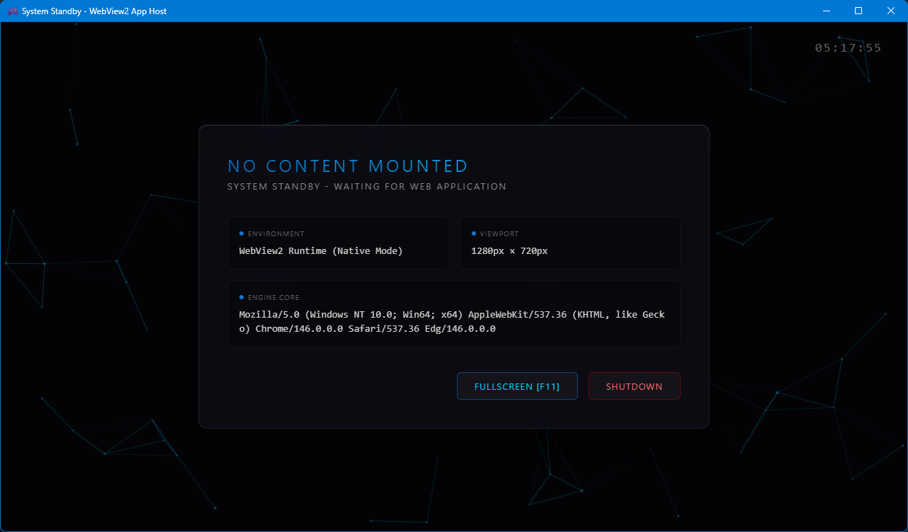

# WebView2 App Host

[](https://github.com/hadamak/webview2-app-host-cs/actions/workflows/build.yml)
[](https://github.com/hadamak/webview2-app-host-cs/releases/latest)
[](LICENSE)
[](https://www.microsoft.com/windows)
[](https://dotnet.microsoft.com)

A lightweight host for distributing HTML/CSS/JavaScript web apps as Windows desktop applications using WebView2.

- Fully local delivery via `https://app.local/`
- Native integration with standard Web APIs like `window.close()` and `requestFullscreen()`
- Web content can be served from a `www/` folder, a ZIP file, an EXE-appended ZIP, or an embedded resource
- Multiple distribution methods available — all keeping the package small and fast



> 🇯🇵 [日本語版 README はこちら](README.ja.md)

---

## Table of Contents

1. [Overview](#overview)
2. [Features](#features)
3. [Comparison](#comparison)
4. [Use Cases](#use-cases)
5. [Requirements](#requirements)
6. [Quick Start](#quick-start)
7. [Replacing Web Content](#replacing-web-content)
8. [Distribution Methods](#distribution-methods)
9. [Configuration](#configuration)
10. [Web API Integration](#web-api-integration)
11. [Steam Integration](#steam-integration)
12. [Limitations](#limitations)
13. [Keyboard Shortcuts](#keyboard-shortcuts)
14. [FAQ](#faq)
15. [Project Structure](#project-structure)
16. [Development Notes](#development-notes)
17. [License](#license)

---

## Overview

This repository is a WebView2-based web app host for Windows. Its goal is to let you take your existing web app assets and distribute them as a desktop EXE with minimal changes.

Intended use cases:

- Wrapping an existing web app for Windows desktop distribution
- Distributing with little to no installation required
- Using different distribution styles (EXE-appended, bundled ZIP, external `www/`) depending on the situation
- Running content that can't be hosted on a network server, served from an `https://` origin without a local server

---

## Features

### 1. No Build Environment Required
Just attach your web content to a pre-built EXE and you have a working application. No .NET SDK, Visual Studio, Node.js, or any other toolchain is needed.

You can choose how to provide content depending on your workflow:

- Place a `www/` folder next to the EXE (instant updates, great for development)
- Place a ZIP with the same name as the EXE next to it
- Append a ZIP to the end of the EXE using `copy /b` (bundle content into a single file)
- Embed content as a resource at build time

### 2. Small Distribution Size
Since WebView2 runtime ships with Windows 10/11, there's no need to bundle Chromium. This keeps the distribution size dramatically smaller than Electron.

### 3. Standard Web API Compatibility
The host provides a browser-compatible environment, so your content doesn't need any special modifications. The following standard Web APIs work out of the box:

- `window.close()` — quit the app
- `element.requestFullscreen()` / `document.exitFullscreen()` — toggle fullscreen
- `beforeunload` — prompt the user before closing
- `target="_blank"` / `window.open()` — open external links in the default browser
- `visibilityState` / `visibilitychange` — detect window minimization

---

## Comparison

Measured results comparing build time and distribution size against other frameworks.

| Target | Build Time | Size | Notes |
|---|---:|---:|---|
| Electron | 12,909 ms | 343.56 MB | 132 MB zipped |
| Tauri (first build) | 391,344 ms | 1.80 MB | installer size |
| Tauri (subsequent) | 126,863 ms | 1.80 MB | installer size |
| Neutralino.js | 1,399 ms | 2.53 MB | 920 KB zipped |
| WebView2Host build | 6,197 ms | 884 KB | 254 KB zipped |
| WebView2Host ZIP-append | 74 ms | 888 KB | 254 KB zipped |
| WebView2Host ZIP-bundle | 0 ms | 888 KB | 258 KB zipped |
| WebView2Host folder | 0 ms | 895 KB | 258 KB zipped |

> When using a pre-built EXE (ZIP-append or folder mode), build time is zero. That's what "no build environment required" really means in practice.

---

## Use Cases

### Fantasy Console
Embed a JS-based game engine in the EXE and treat ZIPs as game cartridges. Drag and drop a ZIP onto the EXE icon to pass it as a launch argument, and the content loads automatically. Swapping cartridges gives a physical, retro console feel.

### Offline Document Viewer
Distribute product manuals or internal documentation as ZIPs, viewable without a network connection. Update the docs by swapping the ZIP — no need to redistribute the viewer.

### Interactive Deliverables
Instead of an installer or explainer video, hand off an interactive HTML experience as an EXE. Product demos, tutorials, trade show presentations — recipients can open them without installing anything.

---

## Requirements

### Development
- Windows 10 or later
- Visual Studio 2022 (.NET desktop development workload)

### Runtime
- Windows 10 or later
- .NET Framework 4.7.2
- WebView2 Runtime

---

## Quick Start

### 1. Clone the Repository

```bash
git clone https://github.com/hadamak/webview2-app-host-cs.git
cd webview2-app-host-cs
```

### 2. Build

```bat
msbuild src\WebView2AppHost.csproj "/t:Restore;Build" /p:Configuration=Release /p:Platform=x64
```

### 3. Run

Execute the generated EXE. On first launch, the sample content will load.

---

## Replacing Web Content

The host treats `web-content/` as the app's primary content directory. Replace its contents with your own web app and rebuild.

### Basic Rules
- `index.html` is the entry point
- Files under `web-content/` are bundled into `app.zip` at build time
- The generated content is embedded into the EXE

### Minimal Structure Example

```text
web-content/
├── index.html
├── app.conf.json
├── assets/
│   └── ...
└── scripts/
    └── ...
```

### Steps to Replace Content
1. Replace the contents of `web-content/` with your app files
2. Edit `app.conf.json` as needed
3. Rebuild
4. Run the output to verify

---

## Distribution Methods

The host supports multiple content delivery modes, which can be mixed and matched per file.

### Content Loading Priority
When the same file exists in multiple locations, the higher-priority source wins.

1. `www/` folder (next to the EXE)
2. ZIP path passed as a launch argument
3. ZIP with the same name as the EXE (e.g. `MyApp.zip` for `MyApp.exe`)
4. ZIP appended to the EXE
5. Resource embedded inside the EXE

### 1. `www/` Folder
Place a `www/` folder next to the EXE and put your content inside.

Best for:
- Instant content updates during development
- Frequently updated assets
- Large files like video or audio that require Range Requests

### 2. Bundled ZIP
Place a ZIP with the same name as the EXE next to it.

Best for:
- Distributing content separately from the EXE
- Plugin- or mod-style extensions

### 3. ZIP-Appended EXE
Physically append a ZIP to the end of the EXE using `copy /b`.

Best for:
- Bundling content and EXE into a single file
- Simplifying the distribution package

```powershell
cmd /c copy /b src\bin\x64\Release\net472\WebView2AppHost.exe + src\app.zip src\bin\x64\Release\net472\MyApp.exe
```

### 4. Embedded Resource
Embed `web-content/` inside the EXE at build time.

Best for:
- Minimal distribution (single file)
- Keeping core files from being extracted or modified

---

## Configuration

### `app.conf.json`

Place this at the root of `web-content/`, or the root of any ZIP or folder. This is intended for content authors.

| Key | Type | Default | Description |
|---|---:|---:|---|
| `title` | string | `"WebView2 App Host"` | Initial window title |
| `width` | int | `1280` | Initial width (pixels) |
| `height` | int | `720` | Initial height (pixels) |
| `fullscreen` | bool | `false` | Start in fullscreen mode |
| `proxyOrigins` | string[] | `[]` | External origins allowed for CORS proxying |

### CORS Proxy

List allowed origins in `proxyOrigins` and the host will transparently forward requests to those origins. Content can use regular `fetch()` calls without any host-specific code. When opened directly in a browser, normal CORS rules apply.

```json
{ "proxyOrigins": ["https://api.example.com"] }
```

```js
// No host-specific code needed in content
const res = await fetch('https://api.example.com/v1/data');
```

Requests to origins not in the allow list are handled by WebView2 as usual (and may fail due to CORS).

> **Limitation:** Due to a WebView2 restriction, request bodies cannot be read from `WebResourceRequested` events. Only GET requests are proxied. POST/PUT with a body are not supported.

### `user.conf.json`

Place this next to the EXE to let end users override window display settings. Values here take precedence over `app.conf.json`. Any omitted fields fall back to `app.conf.json`.

| Key | Type | Description |
|---|---:|---|
| `width` | int | Initial width (pixels) |
| `height` | int | Initial height (pixels) |
| `fullscreen` | bool | Start in fullscreen mode |

### Example

```json
{
  "title": "My App",
  "width": 1440,
  "height": 900,
  "fullscreen": false
}
```

### Dynamic Title and Favicon

The initial window title is taken from `app.conf.json`. After that, the title updates automatically whenever the page `<title>` changes. If a favicon is set, the window icon updates to match as well.

---

## Web API Integration

The host is designed around standard Web APIs — no proprietary bridge required.

### Closing the App
```js
window.close();
```
Closes the application. Per browser spec, this only works when the current page was navigated to by the host itself (not by a user-initiated navigation).

### Fullscreen
```js
element.requestFullscreen();
document.exitFullscreen();
```
The host window state syncs with fullscreen requests from content.

### Close Confirmation
```js
window.addEventListener('beforeunload', (event) => {
  event.preventDefault();
  event.returnValue = '';
});
```
Implement unsaved-changes prompts the same way you would in a browser.

### External Links
URLs opened via `target="_blank"` or `window.open()` with an `http(s)` scheme are opened in the OS default browser.

### Lifecycle Events
- `visibilitychange`
- `fullscreenchange`

These fire when the window is minimized or fullscreen state changes.

### `window.AppBridge`
Not provided. The design intent is to stay close to standard Web APIs rather than adding host-specific APIs.

---

## Steam Integration

Steamworks support is optional. The host itself is designed around standard Web APIs, but Steam integration necessarily uses a proprietary API surface exposed through `steam.js`.

For that reason, this README only points to dedicated, audience-specific documents.

- App developers: `docs/steam/app-integration.md`
- Bridge maintainers: `docs/steam/bridge-build.md`
- Bundled sample: `samples/steam-complete/`

Normal distribution files and Steam-related files are intended to be shipped separately. Add the Steam support bundle only when your app actually needs Steamworks.

Downloading the Steamworks SDK should only be necessary for people who build or modify `steam_bridge.dll`. Regular app developers can use the prebuilt Steam support package as-is.

---

## Limitations

- Because the origin is `https://app.local/`, some Service Worker configurations may require additional setup
- Large files inside a ZIP (video, audio, etc.) are fully expanded into memory on request. If this causes memory pressure, consider placing those files in a `www/` folder instead

---

## Keyboard Shortcuts

Fullscreen is controlled via `requestFullscreen()` / `exitFullscreen()` from content.

### Default Browser Shortcuts

Browser shortcuts such as F5 (reload), Ctrl+F, and Ctrl+P are enabled by default, consistent with browser behavior.

To suppress specific keys in your content, use `keydown` events just as you would in a browser:

```js
window.addEventListener('keydown', (e) => {
    // Prevent F5 / Ctrl+R reload
    if (e.key === 'F5' || (e.ctrlKey && e.key === 'r')) {
        e.preventDefault();
    }
});
```

---

## FAQ

### How do I change the app icon?
Replace `resources/app.ico` and rebuild. You can also set a favicon in your HTML — the window icon will follow after launch.

### How do I open DevTools?
DevTools is enabled automatically in Debug builds. To enable it in a Release build, adjust the `#if DEBUG` block in `src/App.cs`.

### How do I use Steamworks?
The main README intentionally keeps Steam coverage brief. App developers should use `docs/steam/app-integration.md`, while bridge maintainers should use `docs/steam/bridge-build.md`.

### What files do I need to distribute?
This depends on your distribution method, but the typical set is:

- `WebView2AppHost.exe`
- Your content (embedded / bundled ZIP / appended ZIP / `www/` folder)
- `Microsoft.Web.WebView2.Core.dll`
- `Microsoft.Web.WebView2.WinForms.dll`
- `WebView2Loader.dll`
- `WebView2AppHost.exe.config`
- `LICENSE`
- `THIRD_PARTY_NOTICES.md`

A README template for distribution packages is available at `docs/README_TEMPLATE.en.txt`.

### Should I use `www/` or ZIP?
Use `www/` during development, and ZIP or embedded resources for distribution. For large media files, `www/` is the better fit.
Both modes can be used at the same time — you can pick the right location on a per-file basis.

---

## Project Structure

```text
.
├── .github/
│   └── workflows/
├── docs/
├── images/
├── resources/
├── src/
├── web-content/
├── LICENSE
├── README.md
└── THIRD_PARTY_NOTICES.md
```

---

## Development Notes

- Main implementation is under `src/`
- Sample web content is in `web-content/`
- GitHub Actions workflows for automated build and release are included

---

## License

This repository is distributed under the MIT License. For third-party component licenses, see `THIRD_PARTY_NOTICES.md`.
