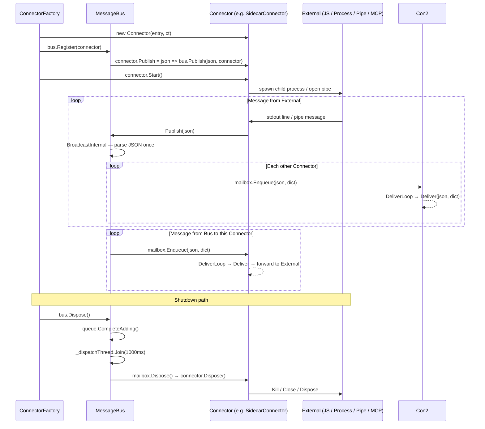

# Connector Lifecycle

This document describes the full lifecycle of a connector — from creation through registration, message delivery, and disposal — using `SidecarConnector` as the primary example. Other connector types follow the same pattern unless noted.

---

## Overview



---

## Phase 1 — Creation

`ConnectorFactory.BuildWithBrowser` (or `BuildHeadless`) reads `AppConfig.Connectors` and instantiates each connector. Order of instantiation mirrors the order declared in `app.conf.json`.

| Connector | Key constructor argument |
|---|---|
| `BrowserConnector` | `WebView2` control |
| `DllConnector` | *(none)* then `Initialize(config)` |
| `SidecarConnector` | `SidecarEntry`, `CancellationToken` |
| `PipeServerConnector` | pipe name, `CancellationToken` |
| `McpConnector` | `AppConfig`, optional `TextReader`/`TextWriter` |

`DllConnector.Initialize` is **idempotent** — the second call is a no-op and logs a warning. Never call `Initialize` after `Register`.

---

## Phase 2 — Registration

```csharp
bus.Register(connector);
```

`MessageBus.Register` performs two actions atomically under `_lock`:

1. Sets `connector.Publish = json => Publish(json, connector)` — wires the connector's outbound path into the bus.
2. Creates a dedicated `ConnectorMailbox` (a `BlockingCollection` + background `Thread`) for inbound delivery to this connector.

After `Register` returns, the connector can publish messages immediately. Delivery to this connector starts as soon as the first message is enqueued in its mailbox.

---

## Phase 3 — Start (transport-specific)

Some connectors require an explicit `Start()` call **after** registration because they spawn background tasks that themselves publish into the bus (which requires `Publish` to be set first).

| Connector | Start mechanism |
|---|---|
| `BrowserConnector` | No explicit `Start()`. Event handler wired in constructor. |
| `DllConnector` | No explicit `Start()`. Events subscribed inside `Initialize`. |
| `SidecarConnector` | `Start()` → `StartStreamingProcess()` — spawns child process. |
| `PipeServerConnector` | `Start()` → `AcceptLoopAsync()` on a thread-pool task. |
| `McpConnector` | `RunAsync(ct)` started by the caller (`App.StartMcpConnector`). |

---

## Phase 4 — Message Delivery

### Outbound (Connector → Bus → Others)

```
External output
  └─ Connector receives raw bytes / line
       └─ Connector calls: _publish(json)           ← set by MessageBus.Register
            └─ MessageBus.Publish(json, sender)
                 └─ _queue.Add((json, sender))
                      └─ DispatchLoop (background thread)
                           └─ BroadcastInternal
                                ├─ parse JSON once (shared dict)
                                └─ foreach other connector:
                                     mailbox.Enqueue(json, dict)
```

### Inbound (Bus → Connector → External)

```
ConnectorMailbox.DeliverLoop (per-connector background thread)
  └─ connector.Deliver(json, dict)
       └─ Connector filters: IsForMe? / IsResponseForMe?
            ├─ yes → forward to External (write to stdin / pipe / WebView2)
            └─ no  → silently ignore
```

**Key design properties:**
- JSON is parsed **once** per broadcast, not once per recipient connector.
- Each connector has its own mailbox thread, so a slow connector cannot block delivery to others.
- The sender connector is excluded from the broadcast to prevent echo loops.

---

## Phase 5 — Disposal

Triggered by `CancellationTokenSource.Cancel()` in `App.Dispose`, followed by `MessageBus.Dispose()`.

```
App.Dispose
  ├─ _shutdownCts.Cancel()        ← signals SidecarConnector, PipeServerConnector, McpConnector
  └─ _bus.Dispose()
        ├─ _queue.CompleteAdding()
        ├─ _dispatchThread.Join(1000ms)
        └─ foreach (connector, mailbox):
             ├─ mailbox.Dispose()
             │    ├─ _mailbox.CompleteAdding()
             │    └─ _deliverThread.Join(500ms)
             └─ connector.Dispose()
                  ├─ SidecarConnector: Kill → WaitForExit(3000ms) → Dispose
                  ├─ PipeServerConnector: Cancel CTS → foreach session: session.Dispose()
                  ├─ McpConnector: unsubscribe UnsolicitedMessage → dispose _in / _out
                  └─ BrowserConnector: _disposed = true → DisposeHandles()
```

### Disposal order guarantees

- `MessageBus` always disposes the **mailbox before the connector** so that in-flight deliveries complete before the connector's resources are freed.
- `SidecarConnector` follows the sequence: **Kill → WaitForExit → Dispose** to avoid zombie processes.
- `McpConnector` unsubscribes `_bridge.UnsolicitedMessage` before any other teardown to prevent callbacks firing into a disposed object.

---

## Connector comparison table

| Connector | Transport | Threading model | Restart |
|---|---|---|---|
| `BrowserConnector` | WebView2 PostWebMessage | UI thread (BeginInvoke) | N/A |
| `DllConnector` | In-process reflection | Caller's thread | N/A |
| `SidecarConnector` | stdio NDJSON | OutputDataReceived thread-pool + `_writeLock` | Exponential backoff, max 5 times, resets after 30s stability |
| `PipeServerConnector` | Named Pipe NDJSON | Per-session send thread + async receive | N/A (caller reconnects) |
| `McpConnector` | stdio JSON-RPC 2.0 | `RunAsync` task + per-request `Task.Run` | N/A |
